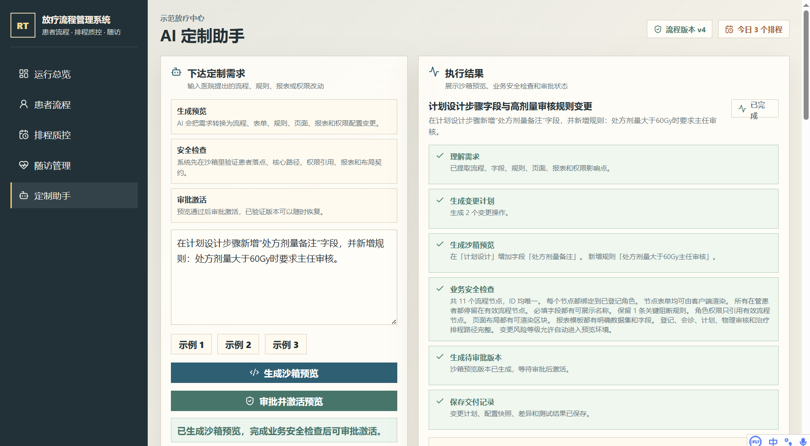
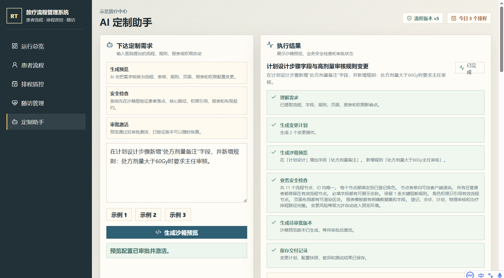
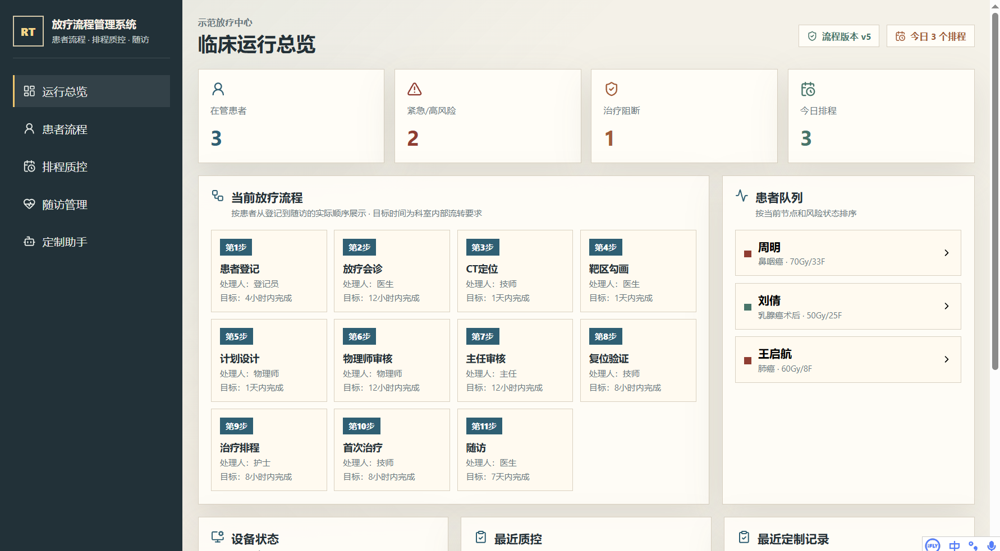
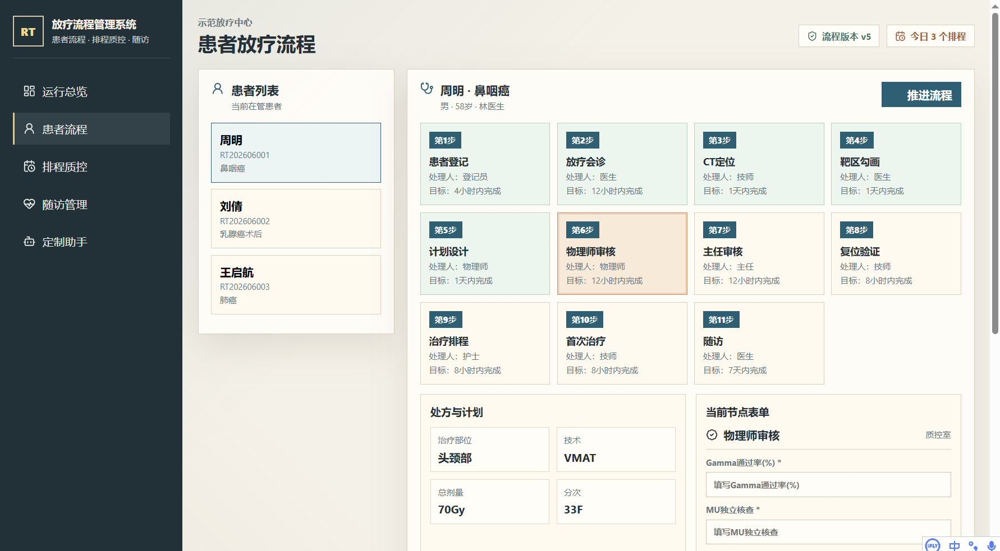
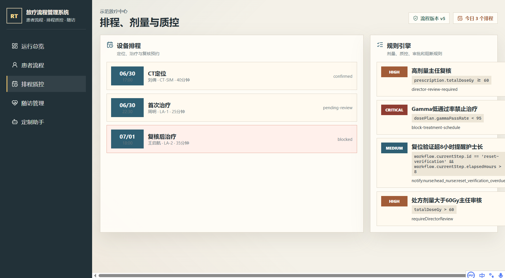
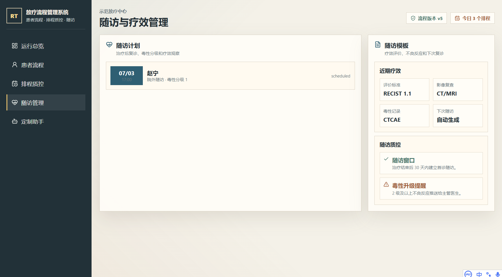

# 放疗流程管理系统

这是一个 Windows 桌面端放疗流程管理系统，主线能力覆盖患者流程、设备排程、计划质控、随访管理和审计留痕。系统内置 AI 定制助手，面向开发人员和实施工程师，用于根据医院的定制化需求生成受控变更计划，在沙箱中预览配置差异，完成业务安全检查后审批激活。

## AI 直接修改软件的实现思路

这个项目回答的是一个很实际的问题：能不能让 AI 直接修改正在使用的软件，让高频业务定制不再每次都经历改代码、开发自测、测试环境验证、生产发布这一整套慢流程。

核心结论是：AI 不应该随意改生产代码并立即生效；更可靠的做法是把高频业务变化提前抽成受控配置，让 AI 修改配置版本，再由系统自动校验、生成沙箱预览、负责人审批激活。用户看到的是“软件被 AI 改了”，工程上仍然保留版本、审计、回滚和业务安全边界。

这套系统把放疗流程管理软件里的高频变化点抽象成版本化配置：流程节点、表单字段、业务规则、页面布局、报表模板和权限矩阵。AI 定制助手读取当前配置和允许操作，把医院需求转成结构化变更计划，在沙箱里生成配置差异并运行安全检查，审批后激活为新的配置版本。

这套方式把传统“改代码、开发自测、测试环境、生产发版”的高频小定制，压缩为“AI 生成配置版本、系统自动验证、负责人审批激活、必要时回滚”。Gitea 用来证明每次 AI 修改都有需求、计划、测试结果、配置前后快照和差异。Jenkins 负责把主分支提交自动验证、构建并部署到远端运行服务。

### 核心原理

这不是让 AI 打开代码仓库随便改文件，也不是把测试和上线流程简单删掉。真正的关键是把软件拆成两层：

```text
稳定工程层：前端、后端、接口、存储、部署、权限框架、校验机制
可变业务层：流程、字段、规则、页面、报表、角色权限
```

稳定工程层仍然由代码实现，保证系统有边界、有校验、有审计、有回滚。可变业务层用配置表达，AI 只允许修改这部分配置。这样，AI 修改软件的本质不是“绕过工程体系”，而是“在工程体系允许的范围内生成新业务配置”。

一次 AI 定制的链路是：

1. 用户输入自然语言需求。
2. 后端读取当前软件配置，包括流程、字段、规则、页面、报表和权限。
3. 后端把当前配置摘要、允许操作清单、输出格式和业务约束发给大模型。
4. 大模型返回结构化变更计划。
5. 后端用 schema 校验计划，不符合结构就要求模型修正。
6. 系统把变更计划应用到沙箱配置副本。
7. 系统生成配置前后快照和差异。
8. 自动检查患者落点、核心路径、权限引用、报表字段、页面布局和关键阻断规则。
9. 检查通过后生成待审批版本。
10. 负责人审批后，配置版本激活，软件行为改变。
11. 交付清单、配置快照和差异提交到仓库，方便追踪和恢复。

### 需要给 AI 什么信息

要让 AI 稳定修改软件，不能只给一句需求。必须给它足够明确的上下文和边界。

第一类是当前软件状态。AI 需要知道系统现在有哪些流程节点、每个节点是什么角色处理、有哪些表单字段、有哪些业务规则、页面有哪些区块、报表有哪些模板、角色权限现在怎么配置。没有当前状态，模型很容易编造不存在的节点、字段、角色和数据源。

第二类是允许操作清单。AI 只能从系统明确支持的操作里选择，例如新增流程节点、修改流程节点、删除流程节点并迁移患者、新增表单字段、修改业务规则、更新页面布局、生成报表模板、调整角色权限。这个清单就是软件开放给 AI 的能力边界。

第三类是输出格式。AI 必须输出结构化 JSON，包含标题、意图、风险等级、变更摘要、操作列表和验证点。系统只接受能通过 schema 的输出，不接受散文式建议。

第四类是业务约束。例如删除流程节点必须指定患者迁移目标，角色只能使用已登记角色，权限只能引用有效流程节点，页面布局只能使用已有数据源，高风险变更必须进入人工审批，核心治疗路径不能断。这些约束决定 AI 的输出是否能落地。

第五类是验收标准。系统必须能检查这次变更是否让患者停留在有效节点、必填表单是否能渲染、关键阻断规则是否保留、权限是否引用了不存在的节点、页面和报表是否有明确数据源。AI 给出计划，系统负责验收。

### 适合直接修改的内容

- 流程节点：新增、调整、删除节点，指定处理角色、目标时限和患者迁移位置。
- 表单字段：给某个流程步骤增加字段、改字段类型、设置必填和选项。
- 业务规则：新增阻断、提醒、审核规则，例如剂量、质控、权限边界。
- 页面布局：调整业务页面展示哪些区块，用什么方式展示。
- 报表模板：生成面向主任、物理师、护士等角色的业务报表。
- 权限矩阵：调整角色能处理哪些流程、能否审批、能否查看报表。

### 不适合直接修改的内容

- 系统还没有建模的新业务能力。
- 底层架构、数据库结构、接口协议、部署脚本。
- 安全策略、密钥、服务器、流水线等基础设施。
- 需要严肃临床判断或法规确认的最终医学结论。

### 和传统方式的对比

传统方式通常是：

```text
需求提出 -> 开发改代码 -> 自测 -> 提交 -> 测试环境 -> 验收 -> 上线 -> 出问题再回滚
```

这个项目的方式是：

```text
需求提出 -> AI 生成配置变更 -> 沙箱预览 -> 自动检查 -> 审批激活 -> 可恢复历史版本
```

优势：

- 小改动速度快：字段、规则、流程、报表、权限这类需求不用每次都改代码。
- 业务可见：负责人能在界面上看到变更计划、差异和检查结果。
- 可追溯：每次 AI 定制都有需求、计划、测试结果、配置快照和差异。
- 可回滚：激活的是配置版本，历史版本可以恢复。
- 风险集中：AI 不能越过 schema 和业务检查随便改系统。

缺点和局限：

- 前期要建模：必须先把流程、字段、规则、权限等做成配置化对象。
- 只能覆盖已建模能力：schema 没覆盖的新需求，仍然需要工程开发。
- 规则复杂度会上升：配置越多，验证、审计和回滚机制越重要。
- 不适合底层重构：数据库、服务拆分、权限体系重做这类仍然走代码开发。
- AI 输出仍需校验：模型会犯错，所以不能把模型输出直接当生产变更。

### 为什么这不是普通配置驱动

普通配置驱动的天花板是：只能改预定义字段，遇到 schema 没覆盖的新需求，还是要人写代码。

这个项目的改进点是把 AI 放在“配置版本生成器”的位置上：

- AI 负责把自然语言需求翻译成结构化配置变更。
- 后端负责限制 AI 的操作范围。
- schema 负责判断输出是否有效。
- 沙箱负责验证变更是否能运行。
- 回归检查负责发现业务风险。
- 审批负责决定是否激活。
- Git 记录负责留痕和复盘。

所以它不是无限配置化，也不是让 AI 绕过工程体系，而是把高频小定制从“代码交付”变成“受控配置交付”。

### 成熟实践对应关系

这套方案对应了几类成熟工程实践：

- GitOps 强调系统期望状态应该声明式表达，并且要版本化、不可变、保留完整历史。这里的配置版本、交付清单和配置快照就是这个思想在业务系统里的落地。参考：[OpenGitOps Principles](https://opengitops.dev/)。
- 十二要素应用强调配置和代码分离，配置应能在不同部署之间独立变化。这里的 AI 定制不是直接改 React 或后端代码，而是生成可审批的业务配置版本。参考：[The Twelve-Factor App: Config](https://12factor.net/config)。
- 功能开关强调可以改变系统行为，而不必每次都发布新代码，同时也会引入复杂度，需要分类和治理。这里的流程、规则、权限配置就是更业务化的行为开关。参考：[Martin Fowler: Feature Toggles](https://martinfowler.com/articles/feature-toggles.html)。
- OpenFeature 说明功能开关可以通过统一接口接入不同实现。这个项目没有接入 OpenFeature，但采用了“业务行为通过受控接口改变”的设计方向。参考：[OpenFeature](https://openfeature.dev/)。

## 核心能力

- 患者流程：患者登记、放疗会诊、CT 定位、靶区勾画、计划设计、物理审核、主任审核、治疗排程、首次治疗、随访。
- 计划质控：处方剂量、分次、DVH 曲线、PTV 覆盖、Gamma 通过率、危及器官约束和治疗阻断规则。
- 设备排程：CT 模拟定位机、直线加速器、TOMO 设备的预约状态和治疗任务。
- 随访管理：治疗后复诊、毒性分级、疗效评价和下次随访计划。
- AI 定制助手：自然语言输入医院需求后，后端调用大模型生成受控变更计划，覆盖流程节点、表单字段、业务规则、页面布局、报表模板和权限矩阵。
- 沙箱预览与审批：AI 变更先生成配置预览和差异，检查通过后由负责人审批激活。
- 配置版本回滚：每次激活都会保存配置版本，可恢复到已验证版本。
- 审计留痕：患者流程推进、定制变更、发布审批都会写入审计日志。
- Gitea 工程留痕：AI 每次定制任务会生成交付清单、配置前后快照和配置差异并提交到 Gitea 仓库。

## 架构

```text
Electron 桌面客户端
  └─ React 临床工作站界面
      └─ 本机/远端 Express API
          ├─ 放疗流程业务模型
          ├─ 患者、排程、质控、随访 API
          ├─ AI 变更计划生成与校验
          ├─ 沙箱预览、业务安全检查与审批激活
          ├─ 配置版本回滚
          ├─ Gitea 交付清单、配置快照和差异提交
          └─ JSON 持久化存储
```

桌面端打开的是 Windows 软件。React 负责界面渲染，Express 负责业务 API 和 AI 调用。AI 密钥放在后端环境变量里，客户端只连接统一后端服务。

默认客户端配置位于 `config/client-config.json`：

```json
{
  "apiBaseUrl": "http://38.76.162.229:8750"
}
```

## 本地运行

```bash
npm install
npm run dev
```

AI 服务配置在 `.env`：

```env
AI_BASE_URL=https://dashscope.aliyuncs.com/compatible-mode/v1
AI_API_KEY=your-server-side-key
AI_MODEL=qwen3.7-plus
RT_API_PORT=8750
RT_API_HOST=127.0.0.1
GITEA_BASE_URL=https://gitea.jaycode.online
GITEA_OWNER=gitadmin
GITEA_REPO=radiotherapy-workflow-system
GITEA_USERNAME=gitadmin
GITEA_PASSWORD=your-gitea-password
GITEA_BRANCH=main
```

## Gitea 仓库

```bash
python scripts/init_gitea_repo.py
```

仓库地址：`https://gitea.jaycode.online/gitadmin/radiotherapy-workflow-system`

AI 定制任务完成后会在仓库的 `ai-deliveries/<job-id>/` 目录生成 `manifest.json`、`config-before.json`、`config-after.json` 和 `config-diff.json`。Gitea Actions 工作流位于 `.gitea/workflows/verify.yml`，用于 push 后执行测试和前端构建。

## Jenkins 自动部署

仓库根目录的 `Jenkinsfile` 是主部署流水线。`main` 分支收到 Gitea push 事件后，Jenkins 执行：

```text
npm ci
npm test
npm run build
python3 scripts/deploy_server.py
```

部署脚本会更新 `38.76.162.229` 上的 `rt-ai-workbench` 服务，服务端口为 `8750`。Gitea 仓库 Webhook 指向服务器上的 Jenkins relay，relay 收到 `main` 分支 push 事件后触发 Jenkins 任务，提交到 `main` 会自动完成验证、构建和远端服务更新。

## 验证

```bash
npm test
npm run build
```

自动化测试覆盖：

- 流程变更应用与回归检查。
- 剂量质控风险识别与治疗阻断。
- 患者流程推进。
- AI 输出不符合 schema 时的自动修正链路。
- AI 定制的沙箱预览、审批激活和配置版本回滚。
- 页面布局、报表模板、权限矩阵等配置化定制对象。

## 打包

```bash
npm run package
```

Windows 桌面端输出到 `release/放疗流程管理系统-win-x64/`。打开 `放疗流程管理系统.exe` 即可运行。生成新产物时会清理旧构建目录，避免误用历史版本。

## 软件截图

### 运行总览



### 患者流程



### 排程质控



### AI 定制结果



### 审批与版本



### 交付记录


